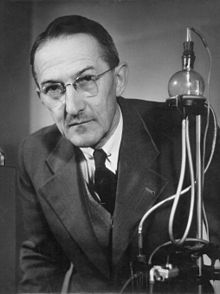
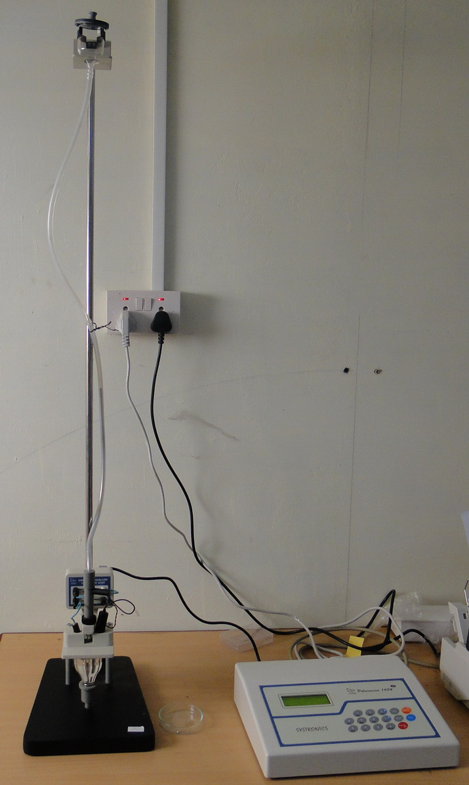
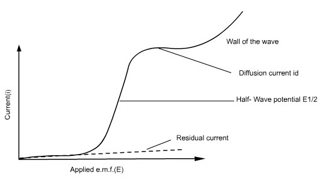
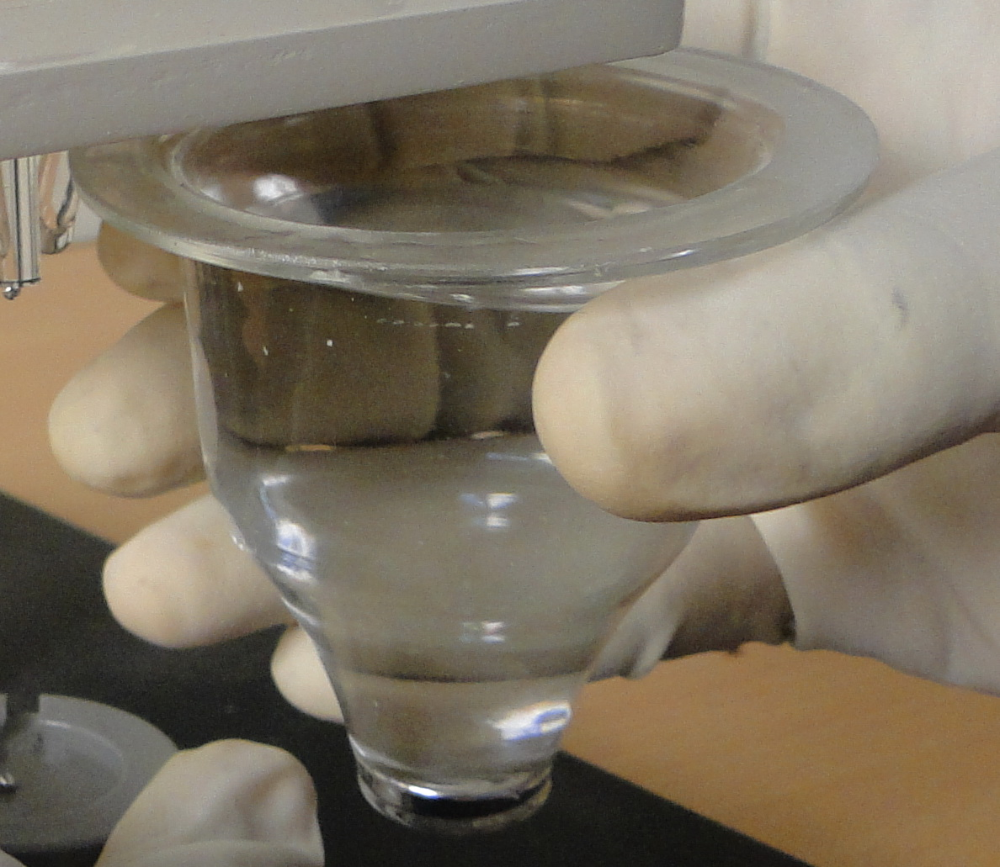
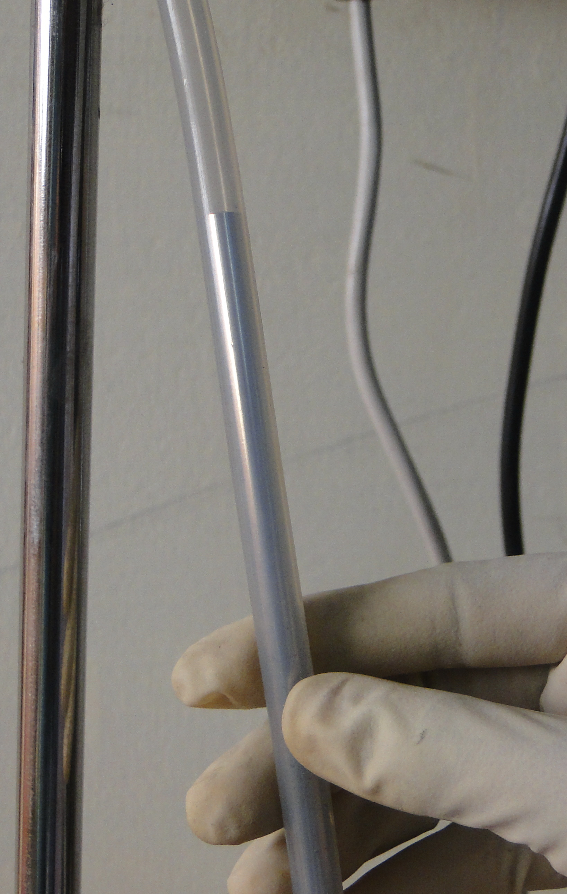
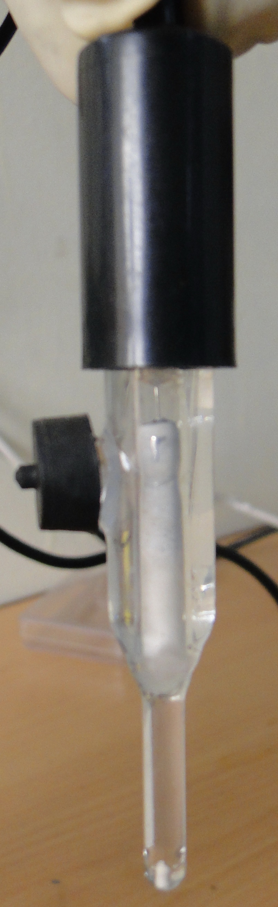
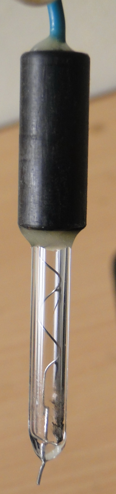
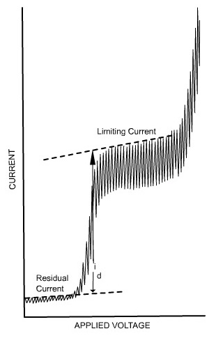

<iframe width="560" height="315" src="https://www.youtube.com/embed/C8CM7d5e5Vg" title="YouTube video player" frameborder="0" allow="accelerometer; autoplay; clipboard-write; encrypted-media; gyroscope; picture-in-picture; web-share" referrerpolicy="strict-origin-when-cross-origin" allowfullscreen></iframe>

### Introduction:
 

Jaroslav Heyrovsky received Nobel Prize in chemistry in 1959 for his discovery and development of the polarographic methods of analysis. He is known as the father of electroanalytical method. Polarographic method directly contributed to the development of innovative ideas in electrochemical techniques, instrumentation and applications.

<strong>Jaroslav Heyrovský</strong>

<h2>Theory:</h2>

  

 

Voltammetry comprises a group of electroanalytical methods widely employed in analytical chemistry and other industrial processes. 
In voltammetry, the information about the analyte is obtained from the measurement of current as a function of applied potential, 
under the conditions of complete concentration polarization. Voltammetry is widely used by inorganic, physical and biological chemists 
for non-analytical purposes, such as the studies of the oxidation and reduction process, adsorption process in various media, 
and electron transfer processes at chemically modified electron surfaces.

Polarography, a branch of voltammetry, is the study of the electrolysis of solutions of electrooxidizable and/or electroreducible substances 
between a dropping mercury electrode (DME) and a reference electrode (RE), which is typically a saturated calomel electrode (SCE). 
This technique falls into the general category of linear-sweep voltammetry, where the electrode potential is usually altered linearly 
from an initial potential to a final potential.

In polarography, the working electrode takes the form of a dropping mercury electrode (DME). It consists of about 10 cm of fine capillary tubing 
through which mercury is forced by a mercury head of about 50 cm. The diameter of the capillary tube is adjusted so that a new mercury drop 
forms and breaks at specific intervals, usually every 2 to 6 seconds. A mechanical knocker can control the drop time by dislodging 
the drop at a fixed time after formation.

The potential between the reference electrode and the DME is varied, and the resulting change in current flow is measured. Since 
the linear sweep method is governed by a combination of diffusion and convective mass transport, the current versus potential 
response (i-E curve) is known as a <strong>Polarogram</strong>, which is typically sigmoid (S-shaped) in form.

The position of a wave in a polarogram along the potential axis provides information on the identity of the substance, 
while the magnitude of the limiting current indicates the concentration of that substance.

<strong>Figure 1: Polarogram </strong>

Since there is an increased flow of current at the starting region of the polarographic wave there is a marked decrease in the concentration of electro-active substance at the surface of the electrode. With the increase in voltage and current the concentration of the reactive species reaches to a minimal value near to the electrode surface. The current is then limited which depends on the diffusion rate of the reacting species from the solution to the electrode surface. The rapid increase of current at the final stage is due to the supporting electrolyte in the reaction. Since the concentration of the electrolyte is too large within the applied potential range, it will prevent the reactive species to reach the electrode by the electrical migration process, and hence the limiting current is assured as diffusion controlled.

Polarographic cell 

Tygon tube with mercury

Reference electrode (Saturated calomel electrode)

Auxillary electrode (Platinum electrode)

Residual current is the slowly increasing current at the foot of the wave which is non-faradaic in nature. 
The distance between the limiting diffusion plateau and the residual current is known as <strong>diffusion current (id)</strong>. 
The potential at the midpoint of the wave is represented as <strong>half-wave potential (E1/2)</strong>, 
in this region the current is exactly half its limiting value.

The limiting current is found to be the sum of the diffusion and residual currents. 
The <strong>wave height</strong> can be calculated by subtracting the residual current from the limiting current.

<strong>Fig 2.</strong>

The limiting current (the plateau on the sigmoid), called the <strong>diffusion current</strong> since diffusion is the most important contribution to the flux of electroactive material at that point of the Hg drop life, is linked to analyte concentration by the <strong>Ilković equation</strong>:

$$i_d=708nD^{\frac{1}{2}}m^{\frac{2}{3}}t^{\frac{1}{6}}c$$

Where:
<ul>
  <li><i>id</i> = diffusion current (μA)</li>
  <li><i>n</i> = number of electrons involved in the reaction</li>
  <li><i>D</i> = diffusion coefficient of the analyte (cm²/s)</li>
  <li><i>m</i> = mass flow rate of mercury (mg/s)</li>
  <li><i>t</i> = drop time (s)</li>
  <li><i>c</i> = concentration of the analyte (mol/L)</li>
</ul>

$$E=E_{1/2}+\frac{0.0591}{n}log\frac{i_d-i}{i}$$

Where, 
E= applied voltage. 
i= current. 

<h2>Applications:</h2>
<ul>
  <li>Polarography is widely employed for the analysis of trace metals in alloys including ultra-pure metals, minerals/metallurgy, environmental analysis, foodstuffs, beverages, and body fluids, toxicology, and clinical analysis.</li>
  <li>In biological systems, it is used to determine vitamins, alkaloids, hormones, terpenoid substances, and more.</li>
  <li>In the medical field, polarography is used to analyze natural coloring substances in drugs and pharmaceutical preparations, determine pesticide or herbicide residues in foodstuffs, and help in structure determination of many organic compounds.</li>
  <li>Since a fresh, smooth, reproducible drop is produced at regular intervals, contamination or surface poisoning is limited.</li>
</ul>

<h2>Determination of the Amount of Cd2+ Present in the Unknown Solution</h2>

<h3>Calibration Curve Method:</h3>
<ol>
  <li>Prepare stock solutions of Cd2+ ion by dissolving 1.0 g of Cd2+ per 1 liter.</li>
  <li>From this, take 1.0, 2.0, 3.0, 4.0, and 5.0 mL into separate 100 mL volumetric flasks.</li>
  <li>Add 50 mL of 2 M KCl solution and 2.5 mL of 0.2% gelatin solution to each flask, then dilute to the mark with distilled water.</li>
  <li>Take 10 mL of unknown solution in a volumetric flask.</li>
  <li>Add 50 mL of 2 M KCl solution and 2.5 mL of 0.2% gelatin solution, then dilute to the mark with distilled water.</li>
  <li>Record the polarograms of the five standard solutions and the unknown after deaeration.</li>
  <li>Draw the calibration curve using wave heights (id) of all five standard solutions as ordinates and concentrations (c) as abscissa.</li>
  <li>From this, note the concentration corresponding to the wave height of the unknown solution.</li>
</ol>

<h3>Standard Addition Method:</h3>
<ol>
  <li>Place 10 mL of the unknown solution, 5 mL of known stock solution (from the calibration curve method), 50 mL of 2 M KCl solution, and 2.5 mL of 0.2% gelatin solution into a volumetric flask and dilute to the mark with distilled water.</li>
  <li>Record the polarogram of this solution in a polarographic cell after removing dissolved oxygen with nitrogen.</li>
  <li>Draw the standard addition plot and calculate the concentration of the unknown solution.</li>
</ol>

